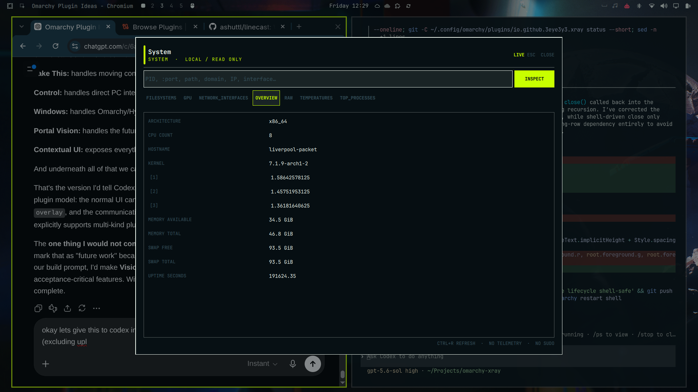

# X-Ray

> See what your computer is actually doing.

X-Ray is a keyboard-first diagnostic instrument for Omarchy. It brings windows, processes, sockets, files, block devices, services, Arch packages, domains, IP addresses, interfaces, and system health into one fast native overlay. The graphical interface and terminal CLI use the same structured, read-only probe engine.



## What it inspects

| Target | Highlights |
|---|---|
| Focused window | Hyprland identity, PID, command, memory, files, sockets, package, cgroup, process tree |
| Process | `/proc` identity, runtime, parent/children, descriptors, sockets, systemd/package associations |
| Port | listeners, owner, protocol, clients, bind exposure, useful HTTP URL |
| File | stat, MIME, hash, symlink, image privacy metadata, ELF details, safe archive listing |
| Disk | `lsblk` topology, filesystems/mounts, optional SMART and NVMe health |
| Service | state, PID, executable, unit file, dependencies, recent logs |
| Package | pacman metadata, dependencies, owned files, executables |
| Domain | bounded DNS, HTTPS/TLS, route, optional trace |
| IP | classification, one-packet reachability, reverse DNS, route, neighbour data |
| Interface | addresses, routes, link state, counters, optional Wi-Fi details |
| System | CPU/load, RAM/swap, filesystems, GPU, temperature, top processes, interfaces |

X-Ray Vision temporarily labels visible Hyprland windows with PID, memory, and thread telemetry. It is a clean toggle on the current plugin API and never steals focus. `xray hud <pid>` uses the same window-following surface for one process. The focused process/window view refreshes live; static probes are collected only when opened or manually refreshed.

## Installation

Omarchy 4.0.x and its schema-1 plugin API are currently supported.

```bash
omarchy plugin add https://github.com/3EYE3Y3/omarchy-xray.git --enable
~/.config/omarchy/plugins/io.github.3eye3y3.xray/scripts/install-cli
```

The first command uses Omarchy's supported Git installer. The second creates a user-owned symlink at `~/.local/bin/xray`; it does not use sudo. Ensure `~/.local/bin` is on `PATH`.

X-Ray does not overwrite a shortcut. On the inspected system `SUPER+X` is already “Universal cut.” A safe example for `~/.config/hypr/bindings.lua` is:

```lua
o.bind("SUPER + CTRL + X", "X-Ray focused window", "xray")
o.bind("SUPER + CTRL + SHIFT + X", "X-Ray Vision", "xray vision")
```

Check first with `omarchy menu keybindings --print`, then validate changes with `hyprctl reload` and `hyprctl configerrors`.

## Usage

Commands open the native overlay by default. Add `--text` for terminal output or `--json` for the stable structured result.

```bash
xray
xray 18422
xray :8080
xray ~/photo.jpg
xray /dev/nvme0n1
xray example.com
xray 192.168.1.20
xray wlan0
xray service sshd
xray package firefox
xray system
xray doctor
```

Explicit types resolve ambiguity: `xray process firefox`, `xray service sshd`, `xray package firefox`, `xray port 8080`, `xray domain example.com`, and `xray interface wlan0`. A bare name that matches multiple process/service/package types returns a chooser rather than guessing.

In the UI, type a target and press Enter, click **Inspect**, use Ctrl+R to refresh, select sections with mouse/keyboard, and press Esc to close.

```bash
xray vision       # toggle labels on every visible window
xray hud 18422    # open the selected process view in live mode
```

## Dependencies

Required on a normal Omarchy/Arch installation: Python 3.11+, Omarchy shell, Hyprland (`hyprctl`), `ss`, `systemctl`, `journalctl`, `ip`, `lsblk`, `pacman`, and `file`.

Optional enhancements: `lsof`, `smartmontools` (`smartctl`), `nvme-cli`, `exiftool`, ImageMagick (`identify`), binutils (`readelf`), `ldd`, `tracepath`, `iw`, and `whois`. Missing optional tools are reported as `OPTIONAL MISSING` and never prevent the core application from opening. X-Ray never installs packages automatically.

## Doctor and diagnostics

```bash
xray doctor
xray system --text
xray 1234 --json | jq
omarchy plugin validate ~/.config/omarchy/plugins/io.github.3eye3y3.xray
```

The Raw section identifies the underlying local source or argv where useful. Slow DNS, TLS, trace, SMART, and journal operations are bounded by timeouts and run outside the QML render path.

### Structured process API

Process and focused-window JSON keep schema version `1`. The `sections.overview` object includes both the original Linux `/proc` display values and integer byte companions:

```json
{
  "rss": "9116 kB",
  "rss_bytes": 9334784,
  "virtual_memory": "10676 kB",
  "virtual_memory_bytes": 10932224
}
```

Linux reports these `/proc` values in KiB despite spelling the unit `kB`; X-Ray converts them with `value * 1024`. An unavailable or malformed source value produces `null` for its byte companion while the original field remains unchanged.

Process trees omit the running X-Ray inspector branch by exact PID ancestry. Direct pipeline peers are identified by the exact pipe inode connected to X-Ray's stdin or stdout, but only when that pipe is not inherited or held by the inspected target. When the inspector is in a job-control process group distinct from the inspected root, all members of that group are also omitted as one inspection job. If none of those identities is distinct, X-Ray removes only its known descendant branch and leaves siblings visible. Names such as `python3`, `jq`, and `sh` are never used as filters.

## Security and privacy

X-Ray is read-only in this acceptance candidate: no sudo, no telemetry, no eval, no arbitrary shell execution, no credential reading, no process environments, no automatic extraction, and no automatic firewall or service changes. External network operations happen only when you explicitly inspect a domain or IP. See [SECURITY.md](SECURITY.md) and [docs/PRIVACY.md](docs/PRIVACY.md).

## Uninstall

```bash
~/.config/omarchy/plugins/io.github.3eye3y3.xray/scripts/uninstall-cli
omarchy plugin remove io.github.3eye3y3.xray
```

Remove any X-Ray lines you manually added to `~/.config/hypr/bindings.lua`, then run `hyprctl reload` and `hyprctl configerrors`. Omarchy handles disabling/unloading and removal of its Git checkout.

## Troubleshooting

- **Overlay does not open:** run `xray doctor`, `omarchy plugin list`, and `omarchy-shell shell rescanPlugins`.
- **No focused window:** focus a normal Hyprland client or pass a PID explicitly.
- **Permission denied:** X-Ray will not elevate; some descriptors, logs, and disk health remain unavailable.
- **Missing disk/image detail:** install the relevant optional utility yourself, then refresh.
- **Vision on multiple/transformed outputs:** disable with `xray vision`; v0.9 is validated on one `eDP-1` output. Multiple outputs can mirror cards, and fractional scaling/output transforms can offset them.
- **Shell issue after editing:** run `omarchy restart shell`; X-Ray does not alter upstream Omarchy files.

Compatibility details and inspected upstream paths are recorded in [docs/UPSTREAM_COMPATIBILITY.md](docs/UPSTREAM_COMPATIBILITY.md). Contributions must preserve the local-first security model described in [CONTRIBUTING.md](CONTRIBUTING.md).

This repository is a v0.9.1 local-acceptance candidate. It has not been submitted to the Omarchy Marketplace.
